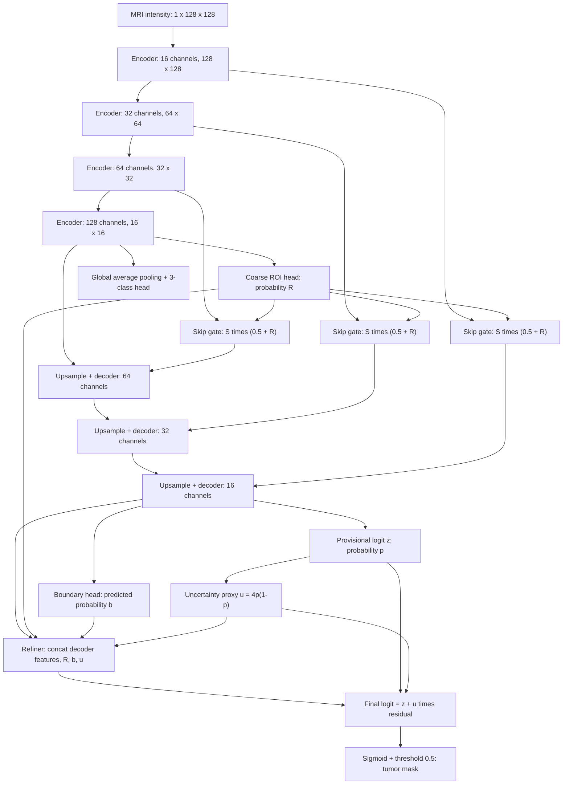

# SoftROI-Boundary U-Net

Presentation diagrams: [overview](output/architecture/architecture_overview.png), [encoder/decoder detail](output/architecture/architecture_backbone.png), and [refinement detail](output/architecture/architecture_refinement.png). Each also has an SVG version in the same folder. [Editable PowerPoint diagrams](output/architecture/SRB_UNet_Architecture_v2.pptx) contain all three views.

The proposal replaces the source paper's explicit detector/crop/segment sequence with a single compact network that learns region guidance and boundary refinement. The experiment establishes that the architecture is implemented and trainable. Any benefit must be read from the measured held-out comparison, not assumed from this diagram.

All ROI maps are resized to the receiving feature tensor's spatial dimensions. Convolutions in the encoder/decoder use GroupNorm and SiLU. The diagram shows the full SRB variant. The baseline omits the coarse head, skip gates, boundary head, and refiner. SoftROI keeps the coarse head and gates, but omits the boundary head and refiner.

## Why each addition might help

| Addition | Hypothesis | What this experiment actually tests |
|---|---|---|
| Supervised coarse ROI | Gives the decoder a task-specific spatial focus | Coarse supervision and gating together |
| Gate floor of 0.5 | Retains features outside a predicted region | Soft feature weighting; no actual hard crop |
| Boundary prediction | Adds supervision for tumor contours | Boundary head/loss plus refiner together |
| Uncertainty-weighted residual | Concentrates corrections where provisional probability is ambiguous | Learned residual modulation, not calibrated uncertainty |

The gate does not ensure that relevant information survives all subsequent convolutions. Likewise, the boundary objective does not guarantee higher boundary F1. These are mechanisms to test, not guarantees.

## Losses and outputs

For a predicted segmentation logit z and mask y:

`L_seg = 0.5 * weighted_BCE(z, y, positive_weight=3) + 0.5 * (1 - soft_Dice(sigmoid(z), y))`

The baseline adds `0.15 * cross_entropy(class_logits, tumor_class)`.

SoftROI adds `0.25 * L_seg(coarse_logits, max_pooled_mask)`. Max pooling preserves small positive regions in the 16 x 16 target.

SRB additionally uses `0.10 * L_boundary`, where L_boundary has the same BCE/Dice form with positive weight 8. The boundary target is a 3 x 3 morphological dilation minus erosion of the mask. The boundary map predicted at inference comes only from decoder features.

The residual head's final layer starts with zero weights and bias. Thus its initial correction is zero. The baseline and proposed variants also start from identical common encoder/decoder/classifier weights within each seed.

## How to describe the contribution

“I propose integrating supervised soft-region guidance and boundary-conditioned residual refinement in a compact U-Net. I implemented the network and evaluated it against a shared-backbone baseline and a region-only ablation on a patient-disjoint Figshare subset.”

Avoid claiming that attention, boundary supervision, or coarse-to-fine segmentation was invented here. [Attention U-Net](https://arxiv.org/abs/1804.03999), [boundary guidance networks](https://www.nature.com/articles/s41598-024-67554-0), and [category-guided attention for brain tumors](https://arxiv.org/abs/2203.15383) are established precedents. A complete literature review is still needed to assess the specificity and novelty of the integration.
